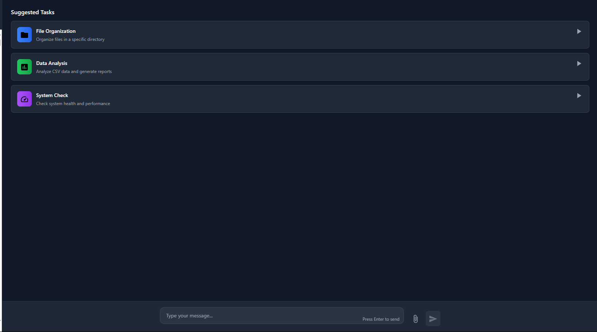
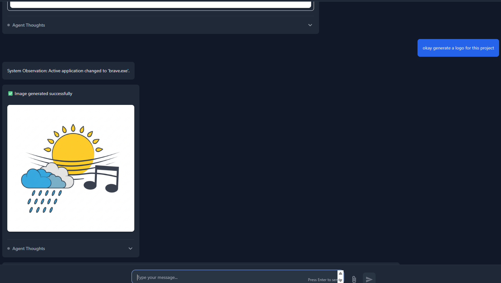
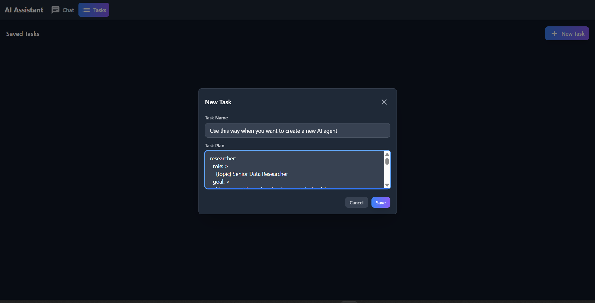
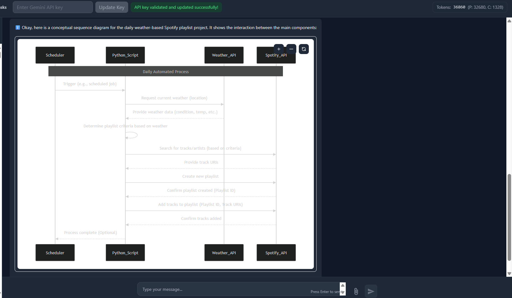
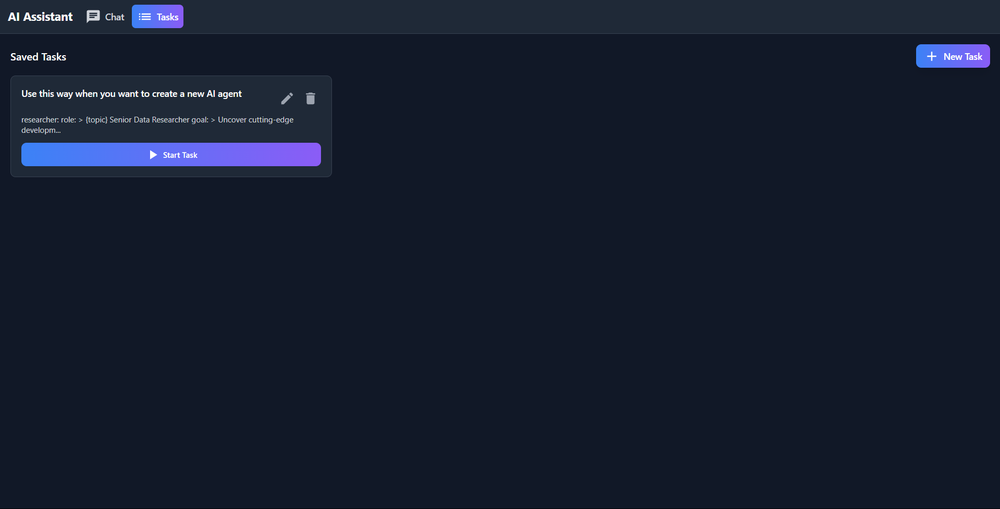

# PC Automation Agent (Vision-Enabled) 🤖

A powerful AI-powered PC automation agent that combines computer vision, natural language processing, and UI automation to help you automate tasks on your Windows PC. The agent provides intelligent task automation with visual feedback, web integration, and customizable task structures.

## 📸 Visual Interface Showcase

### Main Interface

*The intuitive chat-based interface where you interact with the AI agent*

### API Key Configuration

*First-time setup: Enter your API key to get started with the agent*

### AI Image Generation

*Built-in AI image generation capabilities integrated into your workflows*

### Task Structure Creation

*Create new custom task structures for the agent to follow*

### Sequence Diagram Generation

*Automatic generation of sequence diagrams for project planning and visualization*

### Task Structure Management

*View and manage all your custom task structures in one place*

## 🌟 Features

### 1. Vision-Based Automation
- **Screen Understanding**: The agent can see and understand your screen content in real-time
- **UI Element Detection**: Automatically detects and interacts with UI elements
- **Mouse & Keyboard Control**: Precisely moves the mouse and types based on visual screen analysis
- **Text Recognition**: Built-in OCR capabilities for reading text from images and screens
- **Visual Task Verification**: Confirms task completion through visual feedback

### 2. Natural Language Interaction
- **Conversational Interface**: Chat with the agent in natural language
- **Task Planning**: Agent plans and breaks down complex tasks into steps
- **Context Awareness**: Maintains conversation context and task history
- **Smart Suggestions**: Provides intelligent recommendations and multiple approaches before execution

### 3. Advanced Task Management
- **Custom Task Structures**: Define reusable task templates and workflows
- **Task Templates**: Create structured approaches for repetitive tasks (e.g., "always use Word for reports")
- **Task Customization**: Update, modify, or delete custom task structures as needed
- **Task Pausing/Resuming**: Pause and resume tasks at any point
- **Task History**: View and manage past tasks with detailed logs

### 4. Project Visualization
- **Sequence Diagrams**: Automatically generates sequence diagrams for project approaches
- **Visual Planning**: See the workflow visualization before task execution
- **Process Documentation**: Clear visual representation of task execution steps

### 5. File Operations
- **File Processing**: Read, write, and modify files across different formats
- **File Upload**: Support for multiple file types and batch processing
- **Content Analysis**: Process and analyze file contents intelligently
- **Automated File Organization**: Sort and organize files based on content and metadata

### 6. Web Integration & Content Access
- **Web Search**: Comprehensive web search capabilities
- **Web Navigation**: Automate complex web browsing tasks
- **YouTube Integration**: Access and process YouTube video transcriptions
- **Web Content Extraction**: Extract and process web content from any source

### 7. AI-Powered Image Generation
- **Image Creation**: Generate custom images tailored to task requirements
- **Context-Aware Images**: Creates images that suit the specific task process
- **Image Integration**: Seamlessly incorporates generated images into workflows

### 8. Intelligent Tool Integration
- **Multi-AI Approach**: Leverages existing AI tools when they provide better solutions
- **Tool Recommendation**: Suggests multiple approaches and tools before execution
- **Smart Tool Selection**: Automatically chooses the most suitable tools for each task

### 9. System Automation
- **Application Control**: Launch and control applications with precision
- **System Monitoring**: Monitor system resources and processes
- **Shortcut Management**: Create and manage system shortcuts
- **Process Automation**: Handle complex multi-step system operations

## 🚀 Getting Started

### Prerequisites
- **Windows 10 or later** (Windows-only application)
- **Python 3.8 or higher**
- **Node.js and npm** (for frontend interface)
- **Admin rights** (recommended for full functionality)

### Installation Steps

1. **Clone the Repository**


2. **Create Virtual Environment**
```bash
python -m venv .venv
```

3. **Activate Virtual Environment**
- **Windows (CMD):**
```bash
.venv\Scripts\activate
```
- **Windows (PowerShell):**
```bash
.venv\Scripts\Activate.ps1
```
> If activation fails, run: `Set-ExecutionPolicy -Scope Process -ExecutionPolicy Bypass`

4. **Install Python Dependencies**
```bash
pip install -r requirements.txt
```

5. **Install Frontend Dependencies**
```bash
cd frontend
npm install
cd ..
```

6. **Run the Application**
```bash
python app_flask.py
```

7. **Set Your API Key**
- The first time you run the application, it will open in your web browser at `http://localhost:5001`.
- You will be prompted to enter your Google Gemini API key. Paste your key into the input field to activate the agent's capabilities.
- **You must set the API key before you can run any tasks.**

## 💻 Usage

Once the agent is running and your API key is configured, you can start automating tasks by typing instructions into the chat interface.

## ⚠️ Performance Considerations & Limitations

### Vision-Based Automation Performance
- **OCR Processing Time**: The agent uses Tesseract OCR to analyze screen content and locate UI elements. This process can take 2-5 seconds per visual action (click, type, etc.) as it captures screenshots, processes them with OCR, and analyzes the results.
- **Visual Action Overhead**: Each mouse click or keyboard interaction requires screen capture and analysis, which adds latency compared to direct shell commands.
- **Performance Optimization**: The agent prioritizes non-visual actions (shell commands, shortcuts) over visual ones when possible to minimize delays.

### Token Usage Considerations
- **Variable Token Consumption**: Token usage varies significantly based on task complexity and the amount of visual analysis required. Simple shell commands use minimal tokens, while complex visual tasks with multiple screenshots can consume hundreds of tokens per action.
- **Planning Overhead**: The agent's planning system uses tokens for each decision-making step, with complex tasks requiring more planning iterations.
- **Cost Management**: For cost-conscious users, consider using the task structure system (see below) to reduce planning overhead for repetitive tasks.

### Task Structure System - Performance Optimization
The project includes a powerful task structure system that helps mitigate performance issues:

- **Pre-Defined Workflows**: Users can create custom task structures that define specific approaches for repetitive tasks (e.g., "always use Word for reports").
- **Reduced Planning Overhead**: When a similar task is requested, the agent can follow the pre-defined structure instead of planning from scratch, significantly reducing token usage and execution time.
- **Consistent Behavior**: Ensures the agent follows user-preferred approaches rather than potentially choosing inefficient methods.
- **Adaptive Learning**: The system can adapt past successful task executions to new similar tasks, further reducing planning time.

### Recommended Usage Patterns
- **Use Task Structures**: Create task structures for frequently performed tasks to reduce planning overhead.
- **Prefer Shell Commands**: When possible, use shell commands instead of GUI automation for better performance.
- **Batch Operations**: Combine multiple related actions into single commands when feasible.
- **Monitor Token Usage**: The interface displays token usage to help you understand cost implications.

## 🔧 Configuration

### Environment Variables
Create a `.env` file in the project root:
```env
DEBUG_MODE=false
LOG_LEVEL=INFO
ENABLE_WEB_SEARCH=true
ENABLE_IMAGE_GENERATION=true
```

### Custom Settings
- Modify `config.py` for advanced settings
- Adjust automation parameters in `tools/actions.py`
- Customize UI detection in `vision/vis.py`
- Configure task structures in the frontend interface

## 🛠️ Development

### Project Structure
```
├── agents/           # AI agent implementations
├── tools/           # Utility tools and actions
├── vision/          # Computer vision components
├── task_exec/       # Task execution logic
├── utils/           # Helper utilities
├── chromaDB_management/  # VectoreDB management
├── frontend/        # React-based web interface
└── config.py        # Configuration settings
```

### Adding New Features
1. Create new tool in `tools/` directory
2. Add corresponding agent logic in `agents/`
3. Update frontend components if needed
4. Update configuration files
5. Test thoroughly before deployment

## 🔍 Troubleshooting

### Common Issues
1. **Frontend Not Loading**
   - Ensure you ran `npm install` in the frontend directory
   - Check if Node.js is properly installed

2. **API Key Issues**
   - Verify Google API key in `.env`
   - Check API key permissions for web search and image generation

3. **Permission Errors**
   - Run as administrator for full system access
   - Check file/folder permissions for automation tasks

4. **Vision/Screen Capture Issues**
   - Ensure the application has screen capture permissions
   - Check display scaling settings

### Debug Mode
Enable debug mode in `.env`:
```env
DEBUG_MODE=true
LOG_LEVEL=DEBUG
```

## 📚 API Documentation

### Core Functions
- `execute_action()`: Execute automation actions with visual feedback
- `chat_with_user()`: Handle user interactions and multi-approach suggestions
- `assess_action_outcome()`: Evaluate task results using computer vision
- `generate_sequence_diagram()`: Create visual workflow representations

### Vision Functions
- `capture_full_screen()`: Take and analyze screenshots
- `focus_window_by_title()`: Smart window management
- `move_mouse_and_click()`: Precise mouse control based on screen analysis
- `type_text_at_location()`: Context-aware text input

### Task Management Functions
- `create_task_structure()`: Define custom task templates
- `update_task_structure()`: Modify existing task approaches
- `delete_task_structure()`: Remove obsolete task templates
- `list_task_structures()`: View all custom task configurations

## 📝 License

This project is licensed under the MIT License - see LICENSE file for details.

## 🚀 Future Enhancements

### Planned Features
- **Enhanced User Interface**: Developing a more intuitive and modern web-based interface
- **Robust Tool Integration Framework**: Advanced system for seamless integration of new AI tools and services
- **Multi-Language Support**: Expanding beyond English for global accessibility
- **Advanced Analytics**: Detailed task performance analytics and optimization suggestions
- **Cross-Platform Support**: Potential expansion to macOS and Linux

### Upcoming Improvements
- **Better Error Handling**: More robust error recovery and user guidance
- **Performance Optimization**: Faster task execution and resource management
- **Enhanced Security**: Improved data protection and secure API handling
- **Plugin System**: Extensible plugin architecture for custom tools

## 🙏 Acknowledgments

Special thanks to the open-source community and the developers of the tools and libraries that make this project possible.

---

**Platform**: Windows Only  
**Version**: Latest  
**Status**: Active Development

**Need Help?** Open an issue or check the documentation for more details!